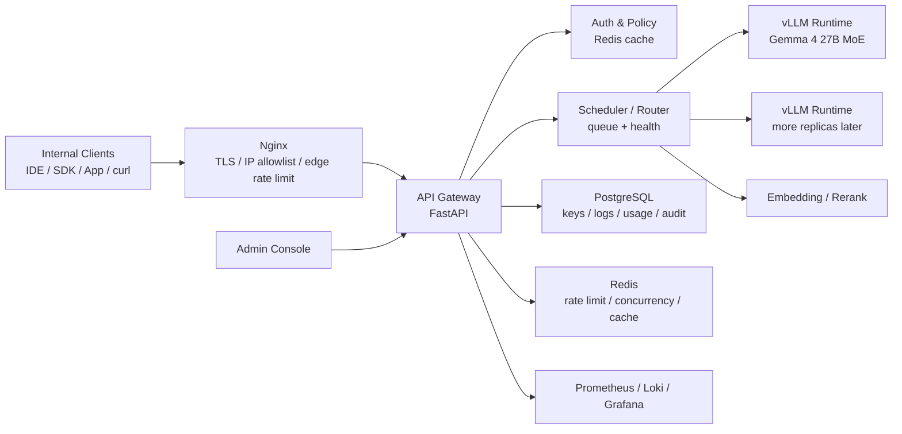

# Local AI Infra Platform

一个面向内网团队的本地大模型 API 平台，用来把自托管推理能力、API Key 管控、限流策略、审计日志和管理后台收拢到同一套控制面里。这个项目的目标不是再造一个“模型聊天页面”，而是把企业内部已经跑起来的大模型服务，整理成一套更像基础设施的产品形态：有统一入口，有明确的权限边界，有可观测性，也有足够现实的运维路径。

当前设计以 **Gemma 4 27B MoE + vLLM** 为主力推理栈，默认部署在 **4× RTX 2000 Ada 16GB** 的单机环境上，强调完全本地化、OpenAI 风格接口兼容、团队级 API Key 管控，以及可逐步演进到多实例调度和后台控制台的能力。

> 这不是一个“已经全部实现完毕”的平台仓库。  
> 它更准确的状态是：**架构方案已经成型，管理后台前端已开始落地，网关、调度器、限流、日志与控制面服务会按阶段逐步实现。**

## Why This Project Exists

很多团队已经能把模型跑起来，但距离“给整个团队稳定使用”还差一层基础设施能力。

直接暴露一个 vLLM 端口当然很快，但很快就会遇到这些问题：谁在用、谁超量、谁有权限访问哪些模型、请求高峰时如何保护 GPU、客户端断开后怎样释放 KV Cache、出了故障如何快速定位、管理员怎么查看实例状态和用量统计。只要开始有多个项目、多个调用方，甚至只是十几个人同时使用，这些问题就会从“以后再说”变成“今天就得解决”。

Local AI Infra Platform 试图回答的正是这一层问题。它把 Nginx、Gateway、Redis、PostgreSQL、调度器、推理实例和管理后台组织成一个完整的调用与治理闭环，让“本地部署的大模型”更接近一个真正可运营的内部平台。

## What The Platform Tries To Be

这个项目的理想形态是一套可以放在内网里长期运行的 LLM 控制面：

- 外部调用仍然尽量保持 OpenAI 兼容，方便 IDE 插件、自研应用、RAG 服务和脚本接入。
- 内部实现则围绕团队使用场景做加强，比如 API Key 模型权限、QPS 与并发双重限流、实例健康检查、请求审计、Embedding 缓存和后台控制台。
- 资源规划以现实机器为前提，而不是默认 A100 集群。设计里明确围绕 4× RTX 2000 Ada 做了显存预算、FP8 量化、KV Cache 预留和并发容量估算。

从仓库的角度看，这里会逐步包含三类东西：平台设计文档、服务端控制面实现，以及一个面向管理员的 Web Console。

## Architecture At A Glance

整个系统的核心思路是把“推理”与“治理”分开。模型实例负责吞吐和生成，Gateway 与控制面负责权限、限流、调度、监控和审计。



如果用一句话概括这条链路，它大概是这样工作的：

客户端通过 HTTPS 访问统一入口，Gateway 提取 API Key 并从 Redis 命中元数据缓存，完成权限与限流校验后，把请求交给调度器；调度器根据模型配置、实例健康状态和当前活跃请求数选择一个后端实例；响应返回给客户端的同时，请求日志、用量统计和审计信息异步进入数据库与监控系统。对于流式请求，Gateway 还需要在客户端断开时及时通知 vLLM 取消生成，避免显存和算力被无效占用。

## Core Ideas Behind The Design

这个平台的设计不是把所有问题都用“多副本”和“更大机器”解决，而是尽量在有限资源下提高稳定性和可控性。

### Quantization First, But Not At Any Cost

设计方案明确把 **FP8** 作为 Gemma 4 27B MoE 的推荐量化方式。原因并不只是“省显存”，而是 FP8 在 Ada 架构上有比较现实的性能与质量平衡：相比 BF16，它显著减轻权重占用；相比 4-bit AWQ，它更适合作为团队通用模型的长期默认配置。

在 4×16GB 的显存条件下，重点不是勉强把模型权重塞进去，而是给 **KV Cache** 留出足够安全的空间。很多线上不稳定恰恰不是因为模型完全装不下，而是并发一上来就因为 KV Cache 紧张出现偶发 OOM、强制截断或不可预测的 500 错误。这个项目在设计上把这件事放到了最前面。

### OpenAI-Compatible Outside, Platform-Oriented Inside

对调用方来说，最好的迁移路径通常不是重新适配一套私有 API，而是继续使用 `/v1/chat/completions`、`/v1/embeddings` 这种熟悉的接口形态。  
但在平台内部，事情会更像一个受控系统而不是纯推理进程：Key 需要有 owner、project、allowed_models、QPS、并发限制和配额；日志需要可以做审计与统计；模型实例需要支持 `start / pause / resume / restart / stop` 这样的运维动作。

### Least Outstanding Requests Instead Of Round Robin

LLM 请求耗时差异很大，这使得传统 round-robin 在推理场景里很快失效。一个短问答可能只需要几秒，一个长文档摘要却可能持续几十秒。如果继续平均轮询，某些实例会被慢请求拖住，另一些实例却处于相对空闲状态。

这个方案更倾向于使用 **Least Outstanding Requests** 这样的调度策略，让请求优先进入当前活跃请求数最少、状态最健康的实例。在后续多副本场景下，还会进一步考虑 Prefix Cache 亲和性，以提升固定 system prompt 场景下的缓存命中率。

### Governance Is A First-Class Feature

这个仓库最重要的取舍之一，是把“治理能力”当作产品的一等公民，而不是事后补丁。  
API Key、限流、审计日志、模型权限、实例状态、硬件指标、告警和后台 UI 都不是附属功能，它们就是这个项目存在的原因。

## What You Will Find In This Repository

目前仓库内容还偏早期，但方向已经很明确：

| Path | Role |
|---|---|
| `docs/design.md` | 平台总体设计方案，包含硬件规划、调用链路、接口设计、监控、安全和部署拓扑 |
| `docs/admin-ui-design.md` | 管理后台的视觉与交互设计方案 |
| `docs/admin-ui-tasks.md` | 管理后台的分阶段实现任务拆分 |
| `web/` | React + Vite + Tailwind 管理后台前端工程，当前处于原型与基础架构阶段 |
| `server/` | 预留给 Gateway / Scheduler / 控制面服务实现 |
| `img/` | 项目图像资源 |

如果你现在克隆这个仓库，最成熟的部分仍然是架构设计与前端信息架构；最值得继续推进的部分，则是服务端控制面的最小可用实现。

## Current Status

这个项目现在更像一个认真打底的开源仓库，而不是已经发布 1.0 的产品。为了让期待更准确，这里把当前状态说清楚：

- 体系设计已经比较完整，尤其是请求治理、实例调度、监控告警和管理后台这几部分。
- 管理后台前端已经搭起基础工程，并开始承接设计稿中的视觉系统和路由结构。
- 服务端 Gateway、Auth/Rate Limit、Scheduler、数据库 schema 落地和推理实例控制逻辑，仍然在实现路径上。
- 换句话说：**这个仓库已经回答了“应该怎么做”，正在逐步回答“代码怎样做出来”。**

如果你想把它当作一个立即可部署的成品平台来使用，现在还太早；但如果你正在做内网 LLM 平台，想找一个兼顾现实硬件约束、治理能力和后台体验的参考骨架，它已经足够有价值。

## Admin Console Direction

这个项目的 Web Console 不是为了做一个漂亮的仪表盘截图，而是为了让平台真的可运维。设计上，它承担的是控制面入口的角色：

- API Key 管理：创建、吊销、调整配额与模型权限
- 模型配置管理：查看模型定义、量化配置、端口与并发限制
- 实例运行控制：启动、暂停路由、恢复、优雅重启、强制停止
- 请求日志与用量汇总：按 key、project、模型和时间维度查看
- 硬件与实时状态：GPU、VRAM、CPU、RAM、队列长度、错误率、P95/P99 延迟

前端目前使用 React + Vite + Tailwind CSS，并采用一套冷色玻璃卡片风格来构建管理台视觉语言。这个选择并不是为了追潮流，而是希望在“运维工具”这个类别中，依然保留良好的层次、留白和可读性。

## API Surface

从接口边界上看，这个平台分成两层。

用户侧接口优先兼容 OpenAI 风格，以降低迁移与接入成本：

- `POST /v1/chat/completions`
- `POST /v1/embeddings`
- `POST /v1/rerank`
- `GET /v1/models`
- `GET /v1/usage`

管理侧接口则围绕平台治理展开，包括：

- `POST /admin/auth/login`
- `GET/POST/PATCH /admin/keys`
- `GET/POST/PATCH/DELETE /admin/models`
- `GET /admin/instances`
- `POST /admin/instances/{id}/start|pause|resume|restart|stop`
- `GET /admin/metrics/summary|timeseries|latency|hardware`
- `GET /admin/requests`
- `GET /admin/usage`
- `GET /admin/alerts`
- `GET /admin/audit`

设计里还定义了统一的错误响应格式，尽量与 OpenAI 的错误结构保持一致，这样调用方在处理认证失败、模型权限不足、限流超限、系统繁忙和上游超时等情况时，不需要维护另一套完全不同的错误分支。

## Security Model

这个项目默认运行在内网里，但“内网”并不等于“不需要安全边界”。  
设计里把安全拆成几层现实可执行的措施：

- 在 Nginx 入口层做 TLS 终止和内网 IP 白名单
- Gateway 只接收来自入口层的流量，不直接暴露推理实例
- API Key 只存 hash，不存明文
- Admin 后台走独立访问路径，并限制在管理网段内
- 管理操作统一写入审计日志
- 控制面与模型运行面在职责上分离，避免直接把所有权限交给推理节点

如果团队后续需要更高等级的约束，也可以在这个骨架上继续加入 LDAP、RBAC、审批流、mTLS 或更细粒度的管理员权限模型。

## Observability And Operations

大模型平台最难受的事情往往不是“完全挂了”，而是“偶发地慢、偶发地爆、偶发地排队”。这类问题如果没有指标，只能靠猜。

这个设计从一开始就要求把请求计数、延迟分位、TTFT、实例活跃请求数、队列长度、GPU 显存占用、错误率和限流命中次数都纳入可观测范围。Prometheus、Grafana 和 Loki 在这里并不是可有可无的附加项，它们是让平台从“能跑”进化到“能运营”的基础。

尤其在流式场景下，客户端断连后的资源回收、TTFT 的统计以及实例健康状态的及时更新，会直接影响使用体验和资源效率。这些细节如果不做，平台表面可用，内部却很难长期稳定。

## Hardware Assumptions

当前方案主要围绕一台 **4× RTX 2000 Ada 16GB** 的机器展开，目标是用尽可能现实的资源做出稳定的团队内部平台，而不是先假设高端 GPU 集群。

设计中的关键结论包括：

- Gemma 4 27B MoE 推荐使用 FP8 量化运行在单实例 `tensor_parallel=4`
- `max_model_len` 以 32K context 为主要目标
- KV Cache 预留被视为稳定性关键指标，而不是可随便压缩的空间
- Embedding 服务可以共享部分剩余显存，但必须严格控制预算

如果你的硬件条件不同，这份设计依然有参考价值，只是其中的显存预算、并发容量和部署拓扑需要重新估算。

## Getting Started

因为仓库仍然在逐步实现阶段，这里的启动建议也分成“理解项目”和“运行当前前端原型”两部分。

如果你是第一次接触这个项目，最推荐的阅读顺序是：

1. 先读 [`docs/design.md`](docs/design.md)，理解平台问题定义、调用链路和控制面边界。
2. 再读 [`docs/admin-ui-design.md`](docs/admin-ui-design.md)，了解后台为什么这样组织信息和交互。
3. 最后看 [`docs/admin-ui-tasks.md`](docs/admin-ui-tasks.md)，理解实现节奏和落地顺序。

如果你想先看 Web Console 原型，可以进入 `web/`：

```bash
cd web
npm install
npm run dev
```

前端工程当前是一个早期管理后台原型，适合用来推进视觉系统、页面布局和接口对接结构，但不应被误解为整个平台已经具备完整后端能力。

## Development Philosophy

这个仓库的一个核心原则是：**先把系统边界想清楚，再让实现逐步接近设计，而不是一开始就把所有代码堆出来。**

这也是为什么你会在当前仓库里看到相对完整的设计文档、后台 UI 方案和任务拆分，而服务端控制面仍在逐步补上。对于基础设施类项目来说，这种顺序往往比“先写一堆接口再补设计”更健康，因为很多真正昂贵的返工，都来自于边界设计不清，而不是某个页面按钮没写完。

## Roadmap

这个项目的路线图可以大致分成三段。

第一段是让平台具备真正可用的 MVP：Gateway、API Key、Redis 限流、PostgreSQL 日志、单实例 vLLM、Embedding 服务以及基础监控。做到这一步，团队成员已经能带着 API Key 稳定调用，管理员也能看到基本状态。

第二段是把平台做稳：多实例调度、健康检查、客户端断连取消、请求排队与背压、Embedding 缓存、更多监控面板和后台控制动作。这一阶段的目标不是“增加功能列表”，而是降低高峰期的随机性和脆弱性。

第三段则偏增强能力：优先级队列、日配额、灰度发布、审批流、LDAP、RBAC，甚至未来迁移到 Kubernetes 与自动扩缩容。

## Who This Is For

如果你符合下面这些情况，这个项目会比较对路：

- 你需要在内网里给一组团队成员稳定提供 LLM API 能力
- 你已经或计划用 vLLM 跑本地模型
- 你不满足于只有一个裸推理端口，希望有治理和审计能力
- 你想要一个既现实又不失工程完整度的参考架构

反过来说，如果你的目标只是快速做一个个人聊天网页，或者完全依赖托管云 API，不打算维护自己的控制面，那这个项目就不是最短路径。

## Related Documents

- [总体设计方案](docs/design.md)
- [Admin UI 设计方案](docs/admin-ui-design.md)
- [Admin UI 任务拆分](docs/admin-ui-tasks.md)

## Contributing

欢迎把这个仓库当作一个正在成长中的平台项目来参与，而不是一个“已经冻结的模板”。  
如果你想贡献，最有价值的方向通常不是微调措辞，而是推进关键路径能力，例如：

- Gateway 与 OpenAI 兼容接口实现
- Redis 限流与并发控制
- 实例调度与健康检查
- Admin 后台的数据接入和可视化
- 部署脚本、监控面板和运维文档

如果你准备提交较大改动，建议先阅读设计文档并确保改动与整体调用链路一致。这个项目最重要的不是某一层代码写得多快，而是整套控制面思路能否持续保持清晰。

## License

当前仓库还没有正式附带开源许可证文件。  
如果你计划对外发布或接受外部贡献，建议尽快补充 `LICENSE`，这样项目边界会清楚很多。
